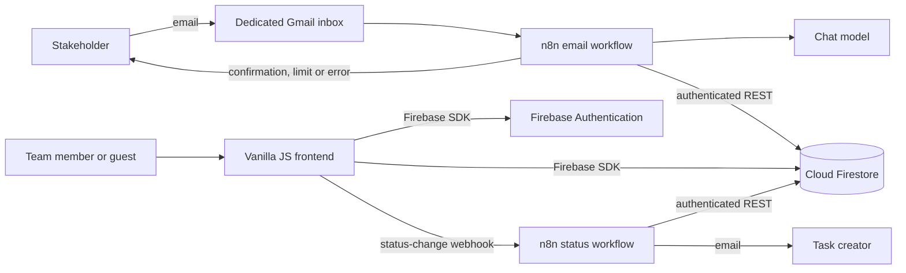

# Architecture and data model

Join Issue Collector extends the existing multi-page Vanilla JavaScript Join
application. The browser remains responsible for the board UI, while Firebase
stores shared data and n8n owns email and AI automation.

## System overview



The frontend never receives the Firebase bot password, Gmail credential or AI
credential. n8n stores those values and signs in as the dedicated Firebase
Authentication user only when a workflow needs Firestore REST access.

## Frontend structure

Root HTML files are route entry points. `main.js` maps each route to a page
component and adds the shared application shell to protected pages.

Reusable markup follows the existing Atomic Design folders:

- `components/html/atoms/` for smallest UI elements;
- `components/html/molecules/` for focused controls;
- `components/html/organisms/` for dialogs and larger shared sections;
- `components/html/pages/` for route-specific markup;
- `components/html/templates/` for the authenticated application shell.

Feature JavaScript is grouped below `components/js/`. Firebase adapters live
in `components/js/firebase/`, while task, board, stakeholder and
authentication behavior stays in its corresponding feature directory.

## Runtime configuration

The browser loads project-specific values from the ignored file:

```text
components/js/firebase/firebaseConfig.js
```

It defines the Firebase web configuration and may also define the production
n8n status webhook:

```js
window.joinFirebaseConfig = {
  // Values copied from the Firebase web app configuration.
};

window.joinN8nStatusWebhookUrl = "PASTE_N8N_PRODUCTION_WEBHOOK_URL";
```

Firebase web configuration identifies a project but is not an administrator
credential. Access is enforced by Firebase Authentication and
`firestore.rules`. The bot password and all third-party secrets still belong
only in n8n credentials or node configuration.

## Firestore collections

### `tasks/{taskId}`

| Field | Type | Purpose |
| --- | --- | --- |
| `title` | string | Required board title, up to 120 characters |
| `description` | string | Optional task description and AI notice |
| `dueDate` | string | Normalized date used by forms and summary |
| `priority` | string | `low`, `medium` or `urgent` |
| `status` | string | `triage`, `todo`, `in-progress`, `feedback` or `done` |
| `category` | string | Join category such as `user-story` or `technical-task` |
| `assignedTo` | array | Contact identifiers |
| `subtasks` | array | Nested subtask values |
| `source` | string | `manual` or `email` |
| `creator` | map | Immutable creator type, name, email and uid |
| `createdAt` | timestamp | Immutable creation time |
| `updatedAt` | timestamp | Last persisted change |

New manual tasks must identify the current authenticated user as an internal
creator. Email tasks must identify an external creator and may be created only
by the dedicated n8n user. Existing legacy tasks without `source` and
`creator` remain readable and editable for compatibility.

### `contacts/{contactId}`

Contacts contain `name`, `email`, optional `phone`, optional `color`,
`createdAt` and `updatedAt`. Authenticated users share this collection.

### `users/{userId}`

Each private profile contains `name`, `email`, `createdAt` and
`updatedAt`. A user may read and update only the document matching their
Firebase Authentication uid.

### `automationQuota/{YYYY-MM-DD}`

| Field | Type | Purpose |
| --- | --- | --- |
| `date` | string | Europe/Berlin date and document ID |
| `used` | integer | Reserved automation attempts, from 0 to 10 |
| `dailyLimit` | integer | Fixed public limit of 10 |
| `updatedAt` | timestamp | Time of the latest reservation |

The stakeholder page may read quota documents so it can display the current
usage without authentication. Only the n8n bot may create or increment them.
Rules require exactly `used: 1` on creation and an increase of exactly one on
each update. The Firestore commit uses an atomic increment, preventing two
simultaneous emails from claiming the same slot.

A slot is reserved before the AI call. Therefore an accepted attempt that
later reaches the manual-review error path still consumes one slot. This is
intentional: the quota is a cost-protection boundary, not a count of successful
board tickets.

## Email intake flow

1. The Gmail trigger polls unread inbox messages.
2. `Extract email request` normalizes sender, subject and body per item.
3. `Check daily request limit` resets its fast local guard at the
   Europe/Berlin day boundary.
4. The n8n bot signs in through Firebase Authentication.
5. `Reserve daily quota slot` atomically increments the shared Firestore
   counter.
6. The model returns title, category, priority, optional deadline and
   description as JSON.
7. `Prepare Firestore task` validates the model response and builds typed
   Firestore REST fields.
8. The workflow creates the task in Triage and confirms receipt.
9. The source email is labeled `erledigt`, archived and marked as read.

Limit and reservation failures skip the AI call. Processing failures use the
`zu bearbeiten` label, archive the original message while keeping it unread,
and notify the sender that manual review is required.

## Status-notification flow

After a board move has been persisted, the frontend posts only `taskId`,
`previousStatus` and `nextStatus` to the production n8n webhook. The
workflow validates these values, signs in as the bot and loads the current task
from Firestore.

n8n sends a notification only when:

- the stored status equals `nextStatus`;
- the stored creator is internal or external;
- the trusted creator map contains a valid email address.

The recipient supplied by Firestore is authoritative. The public webhook
payload cannot choose an arbitrary email recipient.

## Failure boundaries

- Missing browser configuration disables Firebase-backed behavior without
  exposing fallback credentials.
- Firestore rules reject unknown fields, invalid status values, forged manual
  creators and unauthenticated writes.
- Invalid or fenced model output is normalized and then strictly validated.
- Failed task creation cannot continue into the confirmation path.
- A failed creator-notification request does not roll back an already
  persisted board move.
- Sanitized workflow exports use placeholders and are intentionally inactive
  after import.
